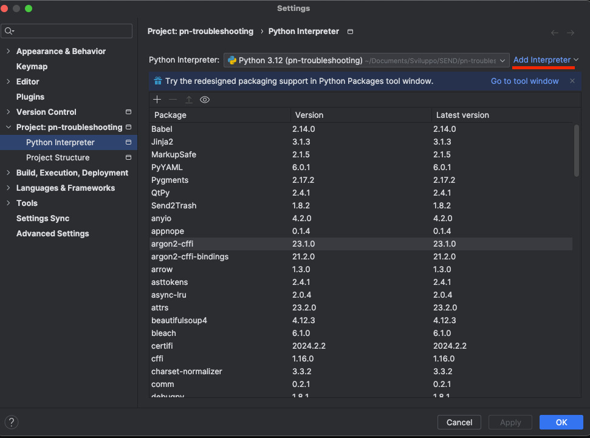
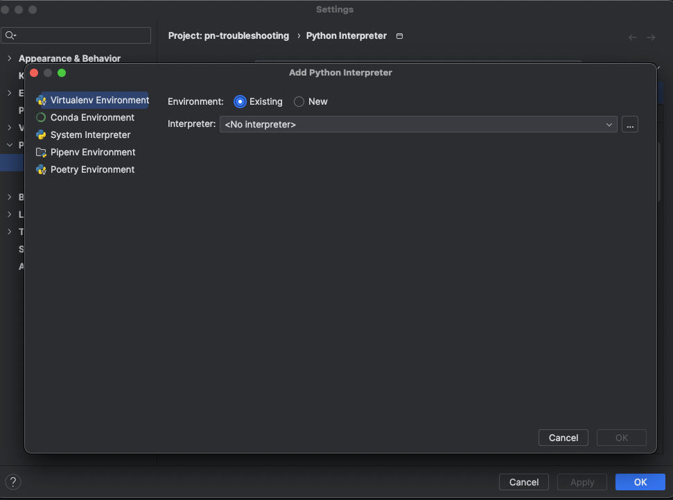
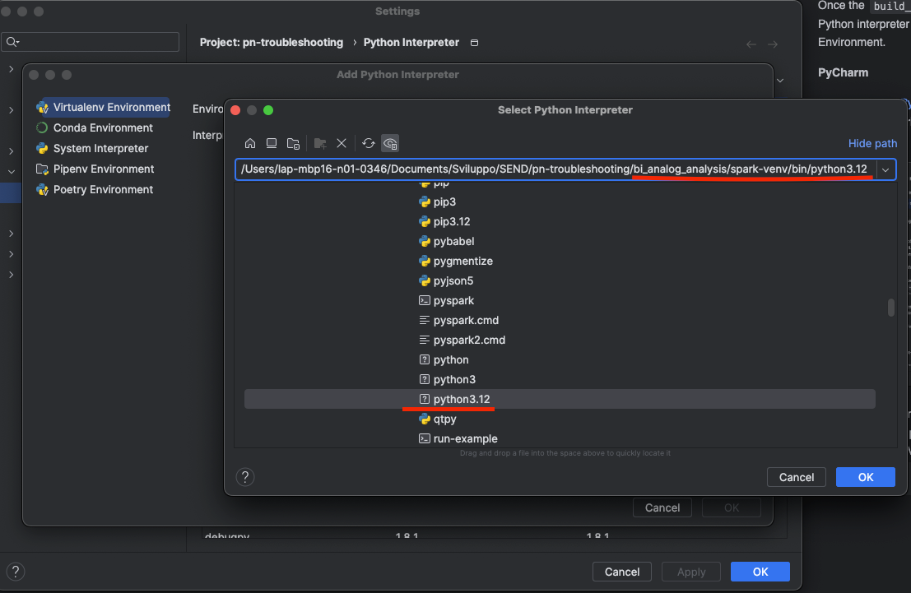

# BI Analog Analysis

BI Analog Analysis contains a notebook [jupyter](https://jupyter.org/) that implements a data pipeline 
to be executed with a Spark job submitted locally or remotely depending on the specific configuration.

The goal is to create ```parquet``` or ```csv``` output containing analog requests in progress
grouped by status sequence history.

## Installation
Before installing all dependencies be sure to have the Python interpreter installed 
with version [3.12.x](https://www.python.org/downloads/release/python-3120/).

In order to configure project and install all dependencies you have to perform the following steps

```bash
# The root of the project
cd bi_analog_analysis/
```

Execute the file ```build_src.sh``` in your terminal.
This simple bash script creates a Python Virtual Environment that will contain 
the necessary dependencies only, to avoid global installation and configuration issues.

All dependencies are listed within ```requirements.txt``` file.

### Python Interpreter Configuration
Once the ```build_src.sh``` is run you have to configure the Python interpreter installed
within the new Virtual Environment.

#### PyCharm
If you are using [PyCharm](https://www.jetbrains.com/pycharm/) open settings 
using the gear icon in the upper right corner then search for 'Python Interpreter'.



Click on 'Add Interpreter' and select 'Add Local Interpreter'.
You should see a page like the screenshot below, with already selected 'Virtualenv Environment'.

Then select the 'Existing' radio button to have the possibility to choose the interpreter created before
with ```build_src.sh``` script.



Clicking the button with 3 dots you have the option of choosing the Python Interpreter from disk.
Our interpreter is located under ```spark-env``` folder created by ```build_src.sh``` script 
with the name ```python3.12```.



Click OK and then Apply to save new configuration.

## Usage
The notebook Jupyter ```sparkAnalysisNotebook.ipynb``` is based on a local configuration
named ```APP_CONFIG``` by executing the first cell:

```python
# Import app configuration
from typing import Dict
from config import APP_CONFIG

spark_config_dict: Dict[str, str] = APP_CONFIG.get('spark', dict())
input_config_dict: Dict[str, str] = APP_CONFIG.get('input', dict())
output_config_dict: Dict[str, str] = APP_CONFIG.get('output', dict())

SPARK_APP_NAME = spark_config_dict.get('name', 'spark-app')
```

In order to make it work you have to create a file with name ```config.ini```
that is included in ```.gitignore``` to avoid pushing custom personalization.

This configuration file MUST follow this structure:
```ini
[spark]
name = spark-app
master = local
memory = 24g
driver.memory = 4g
executor.memory = 5g
executor.cores = 3
executor.instances = 4
dynamicAllocation.enabled = false
logLevel = WARN

[input]
path.metadataRequest = /folder/to/pn-EcRichiesteMetadati
path.analyzeFile = /folder/to/file-to-analyze.csv

[output]
path = /folder/to/save/output
format = parquet
```

The ```spark``` section is related to Spark configuration only and can be
configured accordingly to local machine in which execute Spark job.

The ```input``` section is related to the input of the Spark job

- *path.metadataRequest*: input folder that contains the incremental ```parquet``` extraction 
  from ```ec-RichiesteMetadati```

- *path.analyzeFile*: input ```csv``` file that contains (at least) the ```iun``` column 
  with the IUN to analyze against the incremental extraction.

The ```output``` section is related to the output of the Spark job

- *path*: output folder in which save Spark processing

- *format*: the format of the output processing. It allows two only possible values 
  ```parquet(default)``` or ```csv```

The output regardless of the format will follow the structure (grouped by sequence and attachments):

| sequence | attachments | count | requestInformationSet |
|----------|-------------|-------|-----------------------|

- *sequence*: represents the status code history sequence for the cluster
- *attachments*: represents the received attachments until the last event
- *count*: the amount of request included in the cluster
- *requestInformationSet*: list of JSON (stringify) containing information about all requests in the cluster
  - *requestId* with PCRETRY
  - *paperRequestId* without PCRETRY
  - *registeredLetterCode*