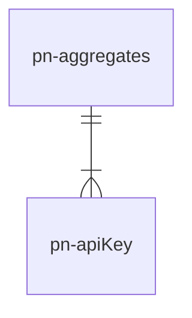

# pn-apikey-manager
Microservizio che ha il compito di creare, rimuovere, ricercare e modificare lo stato delle API Keys.
Dato che AWS ha il limite di 10000 chiavi generabili per ogni region è stato introdotto il concetto di "aggregazione". Un aggregato comprende più chiavi virtuali che fanno capo alla stessa chiave AWS.

## Diagramma ER

