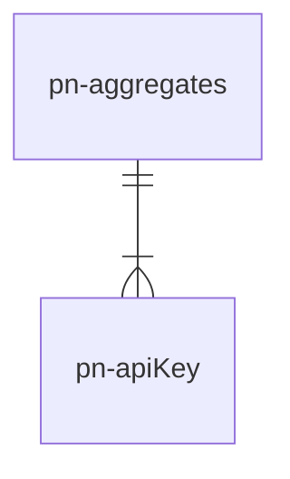

# pn-apikey-manager
Microservizio che ha il compito di creare, rimuovere, ricercare e modificare lo stato delle API Keys.

## Diagramma ER

```mermaid
erDiagram
    pn-aggregates ||--|{ pn-apiKey: ""
```