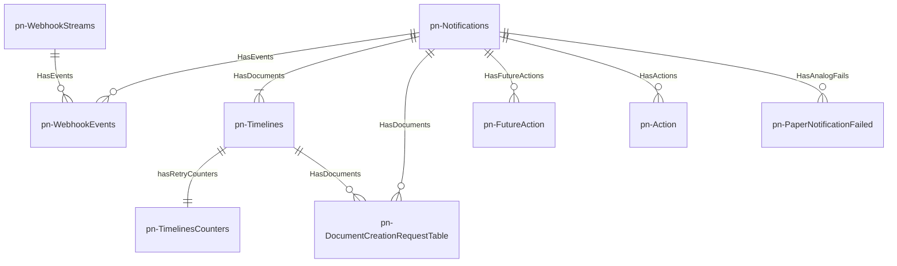

# pn-delivery-push

Microservizio con la responsabilità di gestire il coordinamento e i cambi di stato di una notifica, tracciati per mezzo delle timelines.

Inoltre, il microservizio espone alle PA, tramite API, una componente Webhook, con l'obiettivo di:
- permettere alle PA di creare uno stream di eventi
- permettere alle PA di recuperare gli eventi appartenenti agli stream a cui sono interessate

## Diagramma ER 
Il seguente diagramma mostra come le entità logiche, gestite dal microservizio pn-delivery-push, sono legate tra loro e con la notifica:

Dal diagramma ER precedente sono state omesse due tabelle che hanno uno scopo di solo supporto all'interno processo gestito da pn-delivery-push:

- **pn-PnDeliveryPushShedLock**: gestisce un lock distribuito al fine di evitare che molteplici repliche concorrenti del microservizio pn-delivery-push possano avviare contemporaneamente il job schedulato per la lettura delle Future Actions

- **pn-LastPollForFutureActionTable**: traccia un riferimento temporale (timestamp) che permette al job, che possiede il lock distribuito, di inferire quali azioni devono essere prese in carico