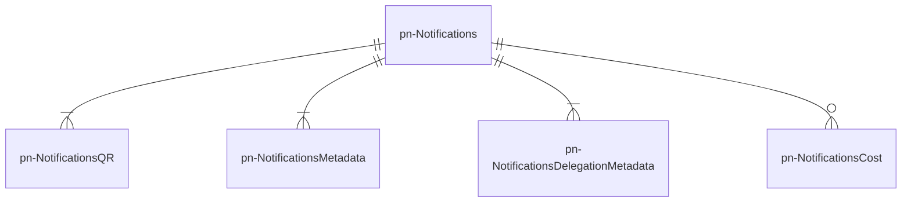

# pn-delivery

Microservizio con la responsabilità di gestire la creazione, la memorizzazione e il recupero delle richieste di notifica e dei documenti allegati.
Il recupero di una notifica può avvenire:
- in maniera puntuale tramite IUN o link per accesso diretto
- in maniera non puntuale tramite ricerche generiche
- a partire da una posizione debitoria, identificata dalla coppia _<taxId, noticeCode>_

Inoltre, il microservizio espone alle PA i costi di notifica calcolati.

## Diagramma ER 
Il seguente diagramma mostra come le entità logiche, gestite dal microservizio pn-delivery, sono legate tra loro e con la notifica:

