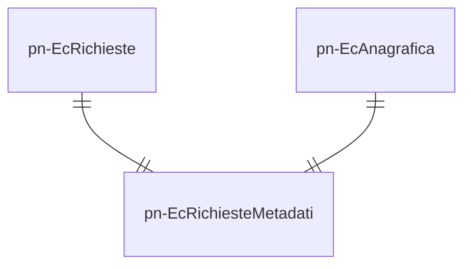

# pn-external-channel
Modulo applicativo che si occupa di astrarre e gestire gli invii di comunicazione attraverso uno dei 4 canali attualmente disponibili (SMS, email, PEC e cartaceo)

## Diagramma ER
