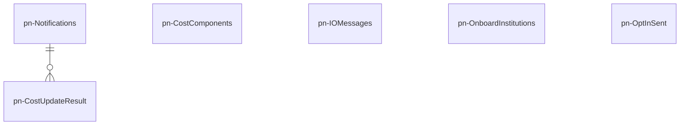

# pn-external-registries
Microservizio che maschera ai componenti di Piattaforma Notifiche la complessità di interfacciarsi con altri servizi di PagoPA come:
* Gestione utenti e gruppi della PA;
* Servizio di pagamento pagoPA: Integrazione PN-pagoPA;
* Invio di messaggi tramite AppIO e interazione con il servizio “TocToc“.

## Diagramma ER
