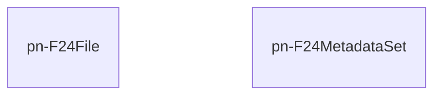

# pn-f24
Microservizio che permette ai client di salvare, validare e generare dei PDF di modelli di pagamento f24, sia in modalità puntuale e sincrona, sia per un insieme di metadati in modo asincrono.

## Diagramma ER
