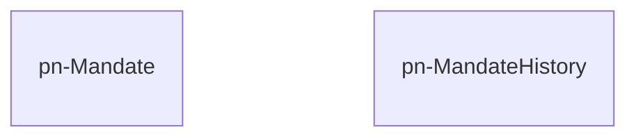

# pn-mandate

Microservizio con la responsabilità di gestire gli accessi in lettura e scrittura sull'entità _delega_, che lega una delegante e un delegato per mezzo di conferimento di poteri di rappresentanza e autorizzazione.

## Diagramma ER 
Il seguente diagramma mostra come le entità logiche, gestite dal microservizio pn-mandate, sono legate tra loro:

Le tabelle non sono collegate direttamente tra loro se non tramite una relazione logica di archivio e svecchiamento dei dati.
Nello specifico, tutti i record presenti nella tabella principale _pn-Mandate_ possono confluire all'interno della tabella _pn-MandateHistory_ nei seguenti casi:
- scadenza naturale della delega, se impostata in fase di creazione
- non accettazione della delega entro 7gg
- revoca della delega da parte del delegante
- rifiuto delle delega da parte del delegato

In tutti i casi di cui sopra, l'entità delega viene memorizzata all'interno della tabella di storico, con un ulteriore **TTL** che ne permette un archivio di 10 anni, superati i quali viene automaticamente rimossa.