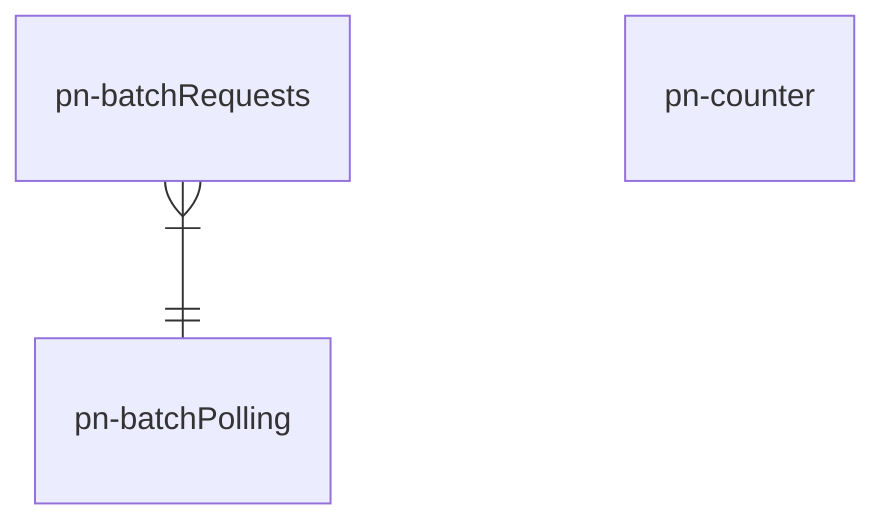

# pn-national-registries

Microservizio con la responsabilità di gestire gli accessi in lettura a vari sistemi esterni per il recupero di domicili digitali e/o fisici appartenenti a persone fisiche (PF) e/o persone giuridiche (PG), nonchè domicili digitali appartenenti alle Pubbliche Amministrazioni (PA).

Inoltre, implementa un insieme di funzionalità per la verifica dell'esistenza e della coerenza di:
- codice fiscale o Partita IVA
- legale rappresentante di un'impresa o persona giuridica

## Diagramma ER 
Il seguente diagramma mostra come le entità logiche, gestite dal microservizio pn-national-registries, sono legate tra loro:

La tabella _pn-counter_ ha come unico scopo quello di contare il numero di richieste che vengono effettuate al servizio esterno **ANPR**, tramite aggiornamento di un contatore atomico monotono strettamente crescente.