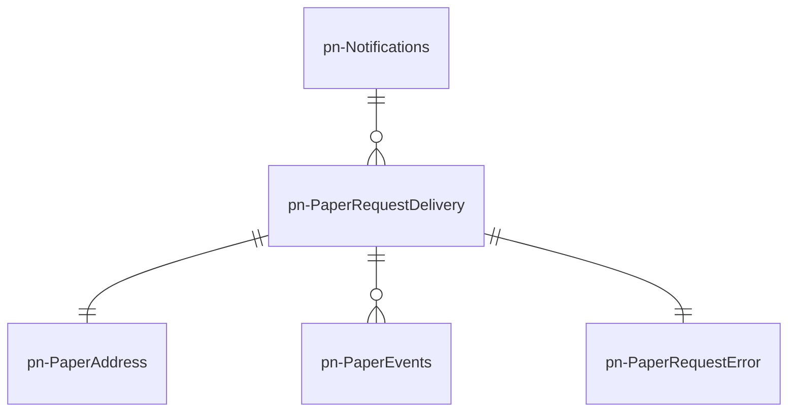
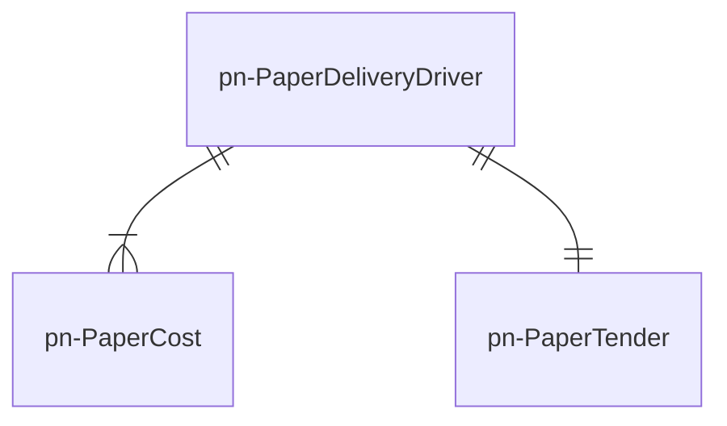

# pn-paper-channel
Microservizio responsabile della gestione dei flussi di spedizione delle notifiche analogiche, in sinergia con pn-delivery-push e si occupa di gestire le operazioni sui recapitisti.

## Diagramma ER

