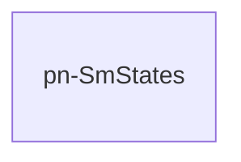

# pn-statemachinemanager
Microservizio che consente, tramite chiamate API, di verificare se la transizione di stato richiesta è considerata valida per uno specifico processo.

## Diagramma ER

```mermaid
erDiagram
    pn-SmStates
```