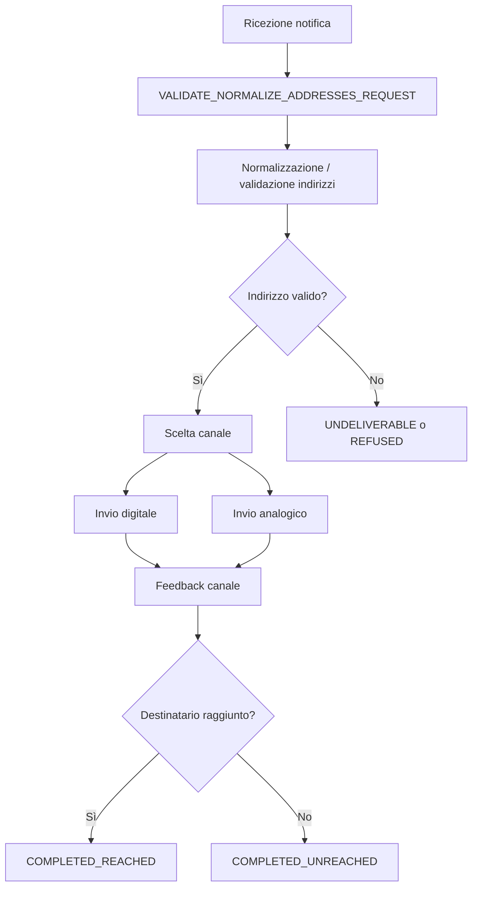
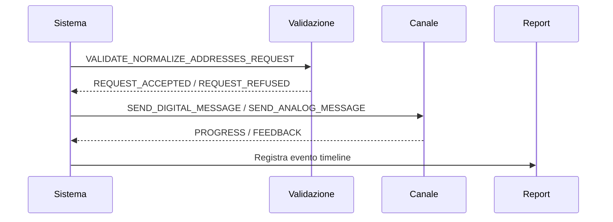

# Documentazione del report `timeline_raw`

## Scopo

Il report `timeline_raw` contiene la cronologia grezza degli eventi generati durante il ciclo di vita di una notifica.

Ogni riga rappresenta un evento della timeline e consente di ricostruire:
- lo stato del workflow;
- i passaggi di validazione;
- la scelta e l’esito del canale di invio;
- eventuali errori o retry;
- il completamento del processo.

Questo report è utile per:
- analisi tecnica;
- troubleshooting;
- audit;
- comprensione del flusso end-to-end delle notifiche.

---

## Struttura generale del record

Nel file CSV, ogni riga contiene spesso un JSON serializzato.

Esempio:

```json
{
  "eventId": "7cd30577-1494-4c06-a870-bf5881331bc5",
  "iun": "RPZN-HLZA-JYHU-202607-P-A",
  "informalElement": {
    "elementId": "VALIDATE_NORMALIZE_ADDRESSES_REQUEST.IUN_RPZN-HLZA-JYHU-202607-P-A",
    "timestamp": "2026-07-21T11:09:26.550655901Z",
    "ingestionTimestamp": "2026-07-21T11:09:26.550655901Z",
    "eventTimestamp": "2026-07-21T11:09:26.550655901Z",
    "notificationSentAt": "2026-07-21T11:08:57.207543305Z",
    "category": "VALIDATE_NORMALIZE_ADDRESSES_REQUEST",
    "details": {}
  }
}
```

### Lettura dell’esempio

Questa riga indica che, per la notifica con IUN `RPZN-HLZA-JYHU-202607-P-A`, il sistema ha avviato la richiesta di validazione e normalizzazione degli indirizzi.

Non è ancora un invio al destinatario: è una fase preliminare di controllo.

---

## Significato dei campi principali

### `eventId`
Identificativo univoco tecnico dell’evento.

### `iun`
Identificativo univoco della notifica.

### `informalElement`
Oggetto che descrive l’evento nella timeline.

#### `elementId`
Identificativo composto dell’evento.

#### `timestamp`
Istante di registrazione dell’evento.

#### `ingestionTimestamp`
Istante in cui l’evento è stato acquisito dal sistema che produce il report.

#### `eventTimestamp`
Istante semantico in cui l’evento è realmente accaduto.

#### `notificationSentAt`
Istante in cui la notifica è stata originariamente inviata nel flusso di partenza.

#### `category`
Categoria dell’evento.

#### `details`
Campo con informazioni aggiuntive specifiche dell’evento.

---

## Categorie di evento più comuni

### Validazione
Eventi iniziali di preparazione e controllo dati.

- `VALIDATE_NORMALIZE_ADDRESSES_REQUEST`
- `VALIDATE_NORMALIZE_ADDRESSES_RESPONSE`
- `NATIONAL_REGISTRY_VALIDATION_CALL`
- `NATIONAL_REGISTRY_VALIDATION_RESPONSE`
- `NATIONAL_REGISTRY_DIGITAL_VALIDATION_CALL`
- `NATIONAL_REGISTRY_DIGITAL_VALIDATION_RESPONSE`
- `REQUEST_ACCEPTED`
- `REQUEST_REFUSED`
- `GET_ADDRESS`
- `NORMALIZED_ADDRESS`

### Invio digitale
Eventi relativi ai canali digitali.

- `SEND_DIGITAL_MESSAGE`
- `SEND_DIGITAL_MESSAGE_PROGRESS`
- `SEND_DIGITAL_MESSAGE_FEEDBACK`
- `SEND_DIGITAL_MESSAGE_SKIP`

### Invio analogico
Eventi relativi alla spedizione fisica.

- `PREPARE_ANALOG_DELIVERY`
- `SEND_ANALOG_MESSAGE`
- `SEND_ANALOG_MESSAGE_PROGRESS`
- `SEND_ANALOG_MESSAGE_FEEDBACK`
- `COVERPAGE_CREATION_REQUEST`

### Chiusura e risultato finale
Eventi conclusivi del workflow.

- `INFORMAL_NOTIFICATION_VIEWED`
- `PAYMENT`
- `DELIVERED`
- `WORKFLOW_DONE_REACHED`
- `WORKFLOW_DONE_UNREACHED`
- `WORKFLOW_ENDED_REACHED`
- `WORKFLOW_ENDED_UNREACHED`
- `WORKFLOW_ENDED_UNDELIVERABLE`

---

## Valori di riferimento più importanti

### `communicationType`
- `INFORMAL`
- `LEGAL`

### `channel`
- `IO`
- `PEC`
- `EMAIL`
- `SMS`
- `ANALOG`

### `recipientType`
- `PF`
- `PG`

### `digitalAddressSource`
- `PLATFORM`
- `SPECIAL`
- `GENERAL`

### `physicalCommunicationType`
- `AR_REGISTERED_LETTER`
- `REGISTERED_LETTER_890`

---

## Stati del workflow

### `IN_VALIDATION`
La notifica è in fase di verifica.

### `ACCEPTED`
La richiesta è stata accettata e può proseguire.

### `REFUSED`
La richiesta è stata respinta.

### `PROCESSING`
Il processo è in corso.

### `COMPLETED_REACHED`
Il destinatario è stato raggiunto.

### `COMPLETED_UNREACHED`
Il workflow si è concluso senza raggiungere il destinatario.

### `UNDELIVERABLE`
Nessun canale valido è disponibile.

### `CANCELLED`
Stato annullato, se previsto dal flusso.

---

## Esiti per canale

### IO
Rappresenta l’interazione con l’app di notifica.

Esiti possibili:
- `SENT_TO_IO`
- `READ`
- `DELIVERED_TO_USER`
- `PAID`
- `SENDER_NOT_ALLOWED`

### PEC
Esiti frequenti:
- `C000` - preaccettazione
- `C001` - accettazione
- `C002` - non accettazione
- `C003` - avvenuta consegna
- `C004` - errore di consegna
- `C006` - rilevazione virus
- `C007` - preavviso errore consegna
- `C008` - errore comunicazione server PEC
- `C009` - dominio PEC non valido
- `C010` - errore invio PEC
- `C011` - address error

### EMAIL
Esiti frequenti:
- `M003` - sent
- `M004` - delivered
- `M005` - bounced
- `M006` - spam
- `M008` - error
- `M009` - destination address not allowed
- `M010` - internal error
- `M011` - composition error

### SMS
Esiti frequenti:
- `S003` - sent
- `S008` - error
- `S010` - internal error

---

## Come interpretare il report

Il report va letto come una sequenza di eventi.

Un flusso tipico è:

1. ricezione della notifica;
2. validazione e normalizzazione indirizzi;
3. eventuale interrogazione di registri esterni;
4. selezione del canale;
5. invio digitale o analogico;
6. ricezione dei feedback;
7. chiusura del workflow.

Ogni record descrive un passaggio del processo, non necessariamente il risultato finale.

---

## Interpretazione dell’esempio selezionato

Per il record mostrato:

- `category = VALIDATE_NORMALIZE_ADDRESSES_REQUEST`
- il sistema sta avviando la verifica degli indirizzi;
- siamo in una fase iniziale del workflow;
- non si tratta ancora di consegna o lettura da parte del destinatario.

In termini semplici:

> La notifica è stata presa in carico e il sistema sta verificando quali indirizzi usare per proseguire l’invio.

---

## Diagramma del flusso tipico



---

## Diagramma sequenziale semplificato



---

## Indicazioni pratiche per chi legge il report

- **Controllare sempre `category`**: è il punto più rapido per capire la natura dell’evento.
- **Usare `eventTimestamp` per l’ordine temporale**: aiuta a ricostruire la sequenza reale.
- **Distinguere evento tecnico da esito finale**: una riga può indicare solo un passaggio intermedio.
- **Leggere il report come storia del workflow**: il significato emerge dalla sequenza completa, non dal singolo record.

---

## Sintesi

`timeline_raw` è il tracciato dettagliato degli eventi di notifica.

Serve per:
- capire come si sviluppa il workflow;
- diagnosticare problemi;
- analizzare i canali di invio;
- ricostruire l’esito finale.

Per interpretarlo correttamente è necessario leggere insieme:
- `iun`
- `category`
- `eventTimestamp`
- `details`
- relazione con gli eventi precedenti e successivi
