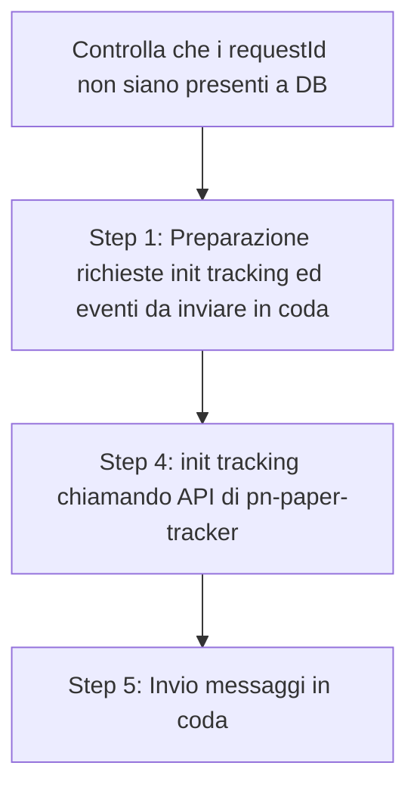

# Bonifica notifiche pregresse pn-paper-tracker



La procedura prende in input il CSV contenente i requestId delle spedizioni che devono essere bonificate.

```
iun,requestId,fine_recapito_stato,perfezionamento_stato
```

> [!IMPORTANT]
> Se una spedizione (attemptId) ha piú PCRETRY questi devono essere inseriti nel CSV.

## Step 1: Prepare tracking events
```
Crea tracking ed eventi da inviare sulla coda di pn-external_channel_to_paper_tracker
Per pcretry0 crea il tracking e eventi da inviare, per pcretryN (N>0) crea solo gli eventi

Variabili d'ambiente:
- CORE_AWS_PROFILE: profilo AWS SSO core
- CONFINFO_AWS_PROFILE: profilo AWS SSO confinfo
- INPUT_FILE: file dei requestId da processare (es. input.csv)
- REGION: default eu-south-1
- BATCH_SIZE: dimensione batch per DynamoDB (default 25, max DynamoDB limit)

Output:
- PCRETRY0_<timestamp>_init_tracking.jsonl (body chiamate a API init tracking)
- PCRETRY0_<timestamp>_intermediate_events.jsonl
- PCRETRY0_<timestamp>_final_events.jsonl
- PCRETRY<N>_<timestamp>_intermediate_events.jsonl
- PCRETRY<N>_<timestamp>_final_events.jsonl
- ERROR_<timestamp>.txt (requestId non processati in caso di errori)


$ CORE_AWS_PROFILE=sso_pn-core-dev CONFINFO_AWS_PROFILE=sso_pn-confinfo-dev INPUT_FILE=./input.csv node 1_prepareTrackingEvents.js
```

## Step 2: Create Trackings
```
Inizializza il tracking delle spedizioni dato il file di input

Variabili d'ambiente:
- HOST: hostname del microservizio (es. http://localhost:3000)
- INPUT_FILE: file JSONL con i body delle richieste (es. out/1_createTracking/PCRETRY0_<timestamp>_init_tracking.jsonl)
- BATCH_SIZE: numero di richieste concorrenti (default 10)
- DELAY_MS: delay tra batch in millisecondi (default 0)

Output:
- ERROR_<timestamp>.jsonl (oggetti con errore dettagliato)
- UNPROCESSED_<timestamp>.jsonl (solo i body non processati, rilanciabili)

$ HOST=http://localhost:8886 INPUT_FILE=./out/1_prepareTrackingEvents/PCRETRY0_20251103181426_init_tracking.jsonl node 2_initTrackings.js
```

## Step 3: Send To Queue
```
Invia eventi letti da file JSONL alla coda SQS di pn-external_channel_to_paper_tracker.

Variabili d'ambiente:
- AWS_PROFILE: profilo AWS SSO (es. core)
- REGION: default eu-south-1
- INPUT_FILE: file JSONL da inviare (es. out/2_createTracking/PCRETRY0_<timestamp>_intermediate_events.jsonl)
- BATCH_SIZE: dimensione batch locale (default 10, max 10 per SQS)
- DELAY_MS: delay tra batch in millisecondi (default 0)
- ACCOUNT_ID: ID account AWS (opzionale, se assente viene ricavato via STS)
- DRY_RUN: se 'true' invia i messaggi in modalità dry run (default 'true')

Output:
- PROCESSED_<input_file>.jsonl (messaggi inviati con eventId)
- ERROR_<input_file>.jsonl (dettagli errori SQS)
- UNPROCESSED_<input_file>.jsonl (messaggi non inviati)

$ CORE_AWS_PROFILE=sso_pn-core-dev INPUT_FILE=./out/1_prepareTrackingEvents/PCRETRY0_20251103181426_intermediate_events.jsonl node 3_sendToQueue.js
```

> [!IMPORTANT]
> Lo script deve essere prima eseguito per gli eventi intermedi e poi per gli eventi finali.

## Step 4: Check tracking events
```
Controlla se pn-paper-tracker ha ricevuto correttamente gli eventi.

Per ogni evento nel file di input:
- Verifica che il relativo tracking esista in DynamoDB
- Controlla che l'evento (messageId) sia presente in tracking.events.id

Variabili d'ambiente:
- CORE_AWS_PROFILE: profilo AWS SSO core
- INPUT_FILE: file dei requestId da processare (es. input.csv)
- REGION: default eu-south-1
- BATCH_SIZE: dimensione batch per DynamoDB (default 25, max DynamoDB limit)

Output:
- ERROR_<timestamp>.jsonl (eventi mancanti o inconsistenze)
- UNPROCESSED_<timestamp>.jsonl (chiavi non processate da DynamoDB)

$ CORE_AWS_PROFILE=sso_pn-core-dev INPUT_FILE=./out/3_sendToQueue/PROCESSED_PCRETRY0_20251103181426_intermediate_events.jsonl node 4_checkTrackingEvents.js
```