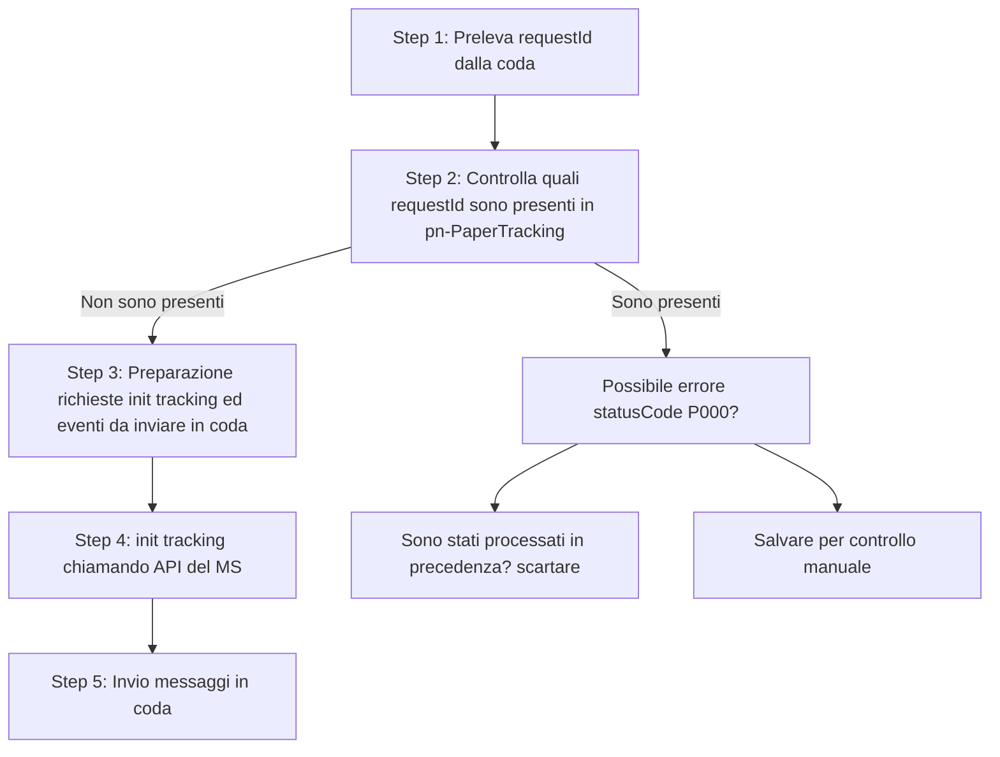

# Bonifica notifiche pregresse pn-paper-tracker



## Step 1: Read messages
```
  Legge messaggi dalla coda pn-external_channel_to_paper_tracker-DLQ in batch da 1000
  e li salva su out/1_readMessages/<timestamp>.jsonl

  Variabili d'ambiente:
  - CORE_CORE_AWS_PROFILE: profilo AWS SSO (obbligatorio)
  - ACCOUNT_ID: ID account AWS (opzionale, se assente viene ricavato via STS)
  - REGION: default eu-south-1
  - LIMIT_MESSAGES: default 1000, massimo numero di messaggi da leggere
  - DELETE_MESSAGES: se "true" cancella i messaggi letti dalla coda (default false)
  - SQS_VISIBILITY_TIMEOUT: default 30, visibilità in secondi dei messaggi letti

  Output:
  - out/1_readMessages/<timestamp>.jsonl (messaggi letti)
  - out/1_readMessages/ERROR_<timestamp>.jsonl (messaggi non eliminati)

  CORE_AWS_PROFILE=sso_pn-core-dev LIMIT_MESSAGES=1000 node 1_readMessages.js
```

## Step 2: Check requestIds
```
  Legge il JSONL da 1_readMessages e verifica che i requestId esistano in Pn-PaperTrackings

  Variabili d'ambiente:
  - CORE_AWS_PROFILE: profilo AWS SSO
  - INPUT_FILE: file JSONL degli eventi della DLQ (es. out/1_readMessages/20250904122434.jsonl)
  - REGION: default eu-south-1
  Output:
  - FOUND_<timestamp>.jsonl
  - NOT_FOUND_<timestamp>.txt (lista di requestId ORDINATI non trovati in Pn-PaperTrackings, con TUTTI i PCRETRY della spedizione)
  - ERROR_<timestamp>.jsonl (in caso di errori di comunicazione con DynamoDB)

  CORE_AWS_PROFILE=sso_pn-core-dev INPUT_FILE=./out/1_readMessages/20250929094602.jsonl node 2_checkRequestId.js
```

## Step 3: Prepare tracking events
```
  Crea tracking ed eventi da inviare sulla coda di pn-external_channel_to_paper_tracker
  Per pcretry0 crea il tracking e eventi da inviare, per pcretryN (N>0) crea solo gli eventi

  Variabili d'ambiente:
  - CORE_AWS_PROFILE: profilo AWS SSO core
  - CONFINFO_AWS_PROFILE: profilo AWS SSO confinfo
  - INPUT_FILE: file dei requestId da processare (es. out/2_checkRequestId/NOT_FOUND_20250929102022.txt)
  - REGION: default eu-south-1
  - BATCH_SIZE: dimensione batch per DynamoDB (default 25, max DynamoDB limit)

  Output:
  - PCRETRY0_<timestamp>_init_tracking.jsonl (body chiamate a API init tracking)
  - PCRETRY0_<timestamp>_intermediate_events.jsonl
  - PCRETRY0_<timestamp>_final_events.jsonl
  - PCRETRY<N>_<timestamp>_intermediate_events.jsonl
  - PCRETRY<N>_<timestamp>_final_events.jsonl
  - ERROR_<timestamp>.txt (requestId non processati in caso di errori)

  CORE_AWS_PROFILE=sso_pn-core-dev CONFINFO_AWS_PROFILE=sso_pn-confinfo-dev INPUT_FILE=./out/2_checkRequestId/NOT_FOUND_20250929102022.txt node 3_prepareTrackingEvents.js
```

## Step 4: Create Trackings
```
  Inizializza il tracking delle spedizioni dato il file di input

  Variabili d'ambiente:
  - HOST: hostname del microservizio (es. http://localhost:8886)
  - INPUT_FILE: file JSONL con i body delle richieste (es. out/3_createTracking/PCRETRY0_<timestamp>_init_tracking.jsonl)
  - BATCH_SIZE: numero di richieste concorrenti (default 10)
  - DELAY_MS: delay tra batch in millisecondi (default 0)

  Output:
  - ERROR_<timestamp>.jsonl (oggetti con errore dettagliato)
  - UNPROCESSED_<timestamp>.jsonl (solo i body non processati, rilanciabili)

  HOST=http://localhost:8886 INPUT_FILE=./out/3_prepareTrackingEvents/PCRETRY0_20251001100335_init_tracking.jsonl node 4_initTrackings.js
```

## Step 5: Send To Queue
```
  Invia eventi letti da file JSONL alla coda SQS di pn-external_channel_to_paper_tracker.

  Variabili d'ambiente:
  - CORE_AWS_PROFILE: profilo AWS SSO core
  - REGION: default eu-south-1
  - INPUT_FILE: file JSONL da inviare (es. out/3_createTracking/PCRETRY0_<timestamp>_intermediate_events.jsonl)
  - BATCH_SIZE: dimensione batch locale (default 10, max 10 per SQS)
  - DELAY_MS: delay tra batch in millisecondi (default 0)

  Output:
  - ERROR_<timestamp>.jsonl (dettagli errori SQS)
  - UNPROCESSED_<timestamp>.jsonl (messaggi non inviati)

  CORE_AWS_PROFILE=sso_pn-core-dev INPUT_FILE=./out/3_prepareTrackingEvents/PCRETRY0_20251001100335_intermediate_events.jsonl node 5_sendToQueue.js
```
Lo script deve essere prima eseguito per gli eventi intermedi e poi per gli eventi finali.

## 🔎 Recupero eventi pn-paper-tracker (`/paper-tracker-private/v1/trackings`)

```bash
curl -X POST "https://<base-url>/paper-tracker-private/v1/trackings" \
  -H "Content-Type: application/json" \
  -d '{
    "trackingIds": [
      "PREPARE_ANALOG_DOMICILE.IUN_LNKN-UHAM-KEZH-202508-X-1.RECINDEX_0.ATTEMPT_0.PCRETRY_0",
      "PREPARE_ANALOG_DOMICILE.IUN_LNKN-UHAM-KEZH-202508-X-2.RECINDEX_0.ATTEMPT_0.PCRETRY_1"
    ]
  }'
```


## 🔎 Recupero errori pn-paper-tracker(/paper-tracker-private/v1/errors)

```bash
curl -X POST "https://<base-url>/paper-tracker-private/v1/errors" \
  -H "Content-Type: application/json" \
  -d '{
    "trackingIds": [
      "PREPARE_ANALOG_DOMICILE.IUN_LNKN-UHAM-KEZH-202508-X-1.RECINDEX_0.ATTEMPT_0.PCRETRY_0",
      "PREPARE_ANALOG_DOMICILE.IUN_LNKN-UHAM-KEZH-202508-X-2.RECINDEX_0.ATTEMPT_0.PCRETRY_1"
    ]
  }'
```